<div align="center">

<a href="https://cacg-code.github.io/PRACTICAS-HTML/">
  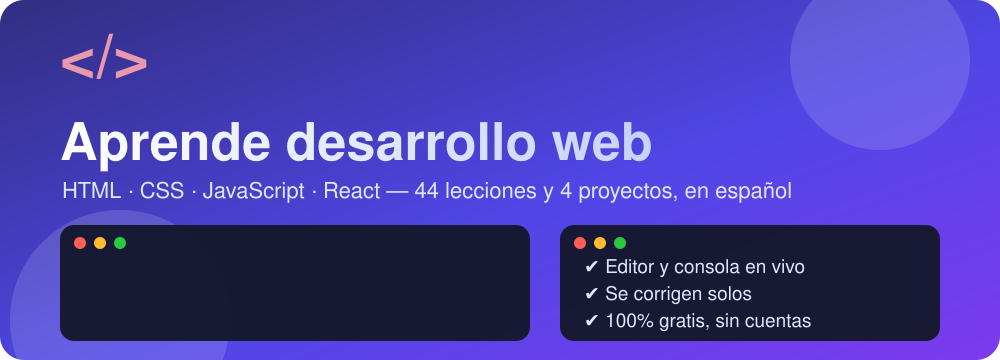
</a>

<br>

<a href="https://cacg-code.github.io/PRACTICAS-HTML/">
  
</a>

<br>


*Se abre en tu navegador. Sin cuentas, sin descargas, sin instalar nada.*

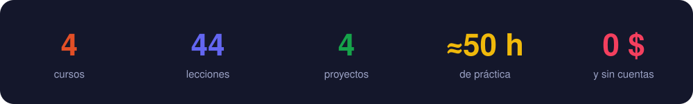

</div>

<p align="center">
  <a href="#-los-cursos"><b>Cursos</b></a> ·
  <a href="#-míralo-en-acción"><b>En acción</b></a> ·
  <a href="#️-ruta"><b>Ruta</b></a> ·
  <a href="#-cada-lección"><b>Lección</b></a> ·
  <a href="#-chuleta"><b>Chuleta</b></a> ·
  <a href="#-faq"><b>FAQ</b></a> ·
  <a href="#-contribuir"><b>Contribuir</b></a>
</p>

---

## 🎓 Los cursos

Sigue el orden: cada curso se apoya en el anterior.

<div align="center">

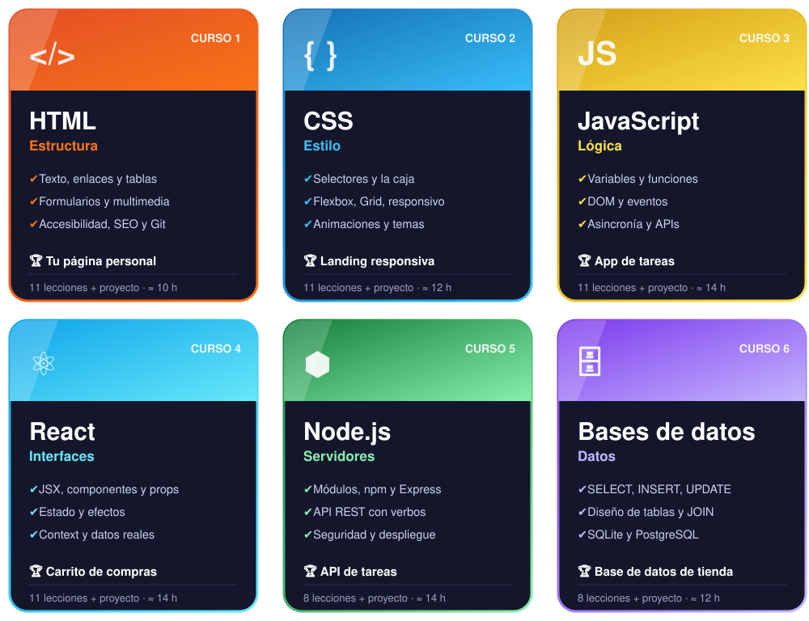

**[▶ Empezar HTML](https://cacg-code.github.io/PRACTICAS-HTML/html/)** &nbsp;·&nbsp; **[▶ Empezar CSS](https://cacg-code.github.io/PRACTICAS-HTML/css/)** &nbsp;·&nbsp; **[▶ Empezar JavaScript](https://cacg-code.github.io/PRACTICAS-HTML/javascript/)** &nbsp;·&nbsp; **[▶ Empezar React](https://cacg-code.github.io/PRACTICAS-HTML/react/)**

</div>

## 🎬 Míralo en acción

<div align="center">

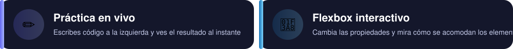
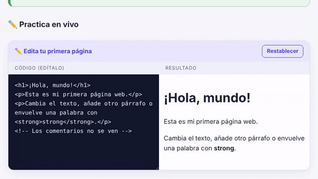&nbsp;&nbsp;&nbsp;&nbsp;&nbsp;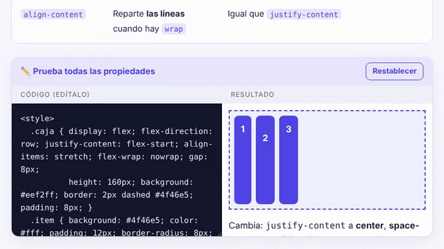

<br><br><br>


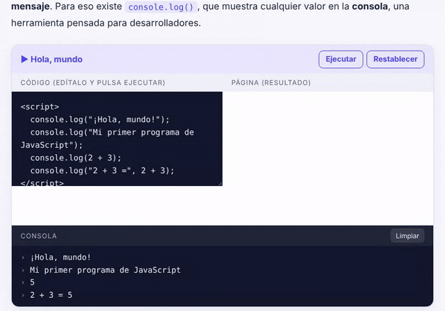&nbsp;&nbsp;&nbsp;&nbsp;&nbsp;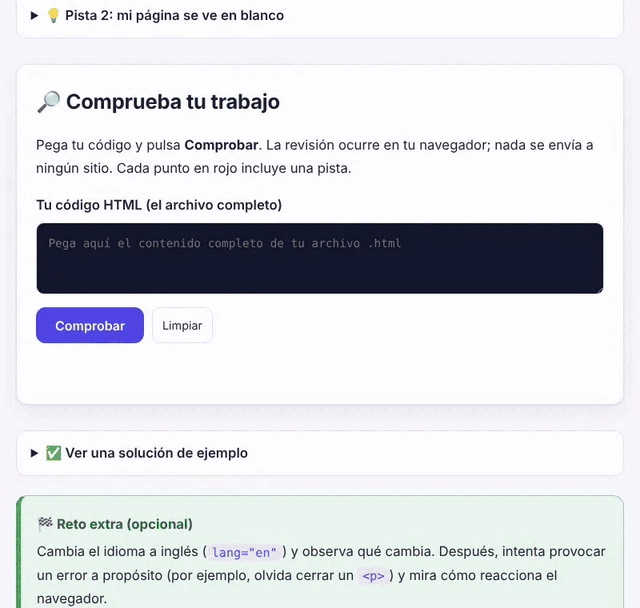

<br><br><br>

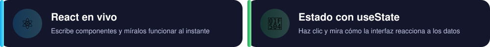
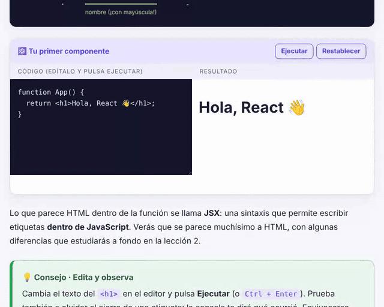&nbsp;&nbsp;&nbsp;&nbsp;&nbsp;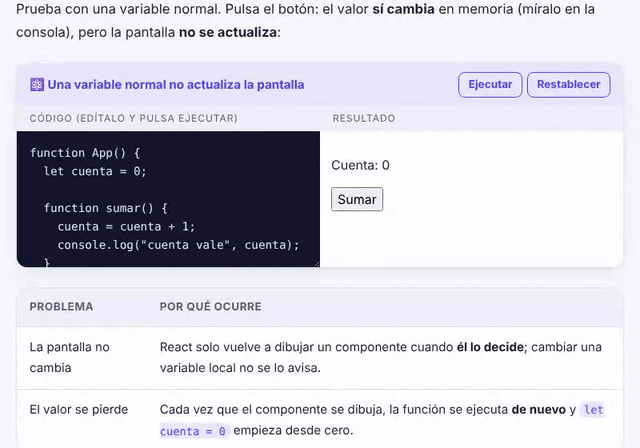

</div>

## 🗺️ Ruta

<div align="center">
  
</div>

## 🔁 Cada lección

<div align="center">

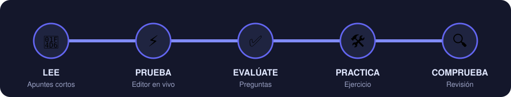

⚡ Editores en vivo y **consola** en JavaScript &nbsp;·&nbsp; 🔍 **Comprobador** de ejercicios<br>
💾 Borrador y progreso guardados &nbsp;·&nbsp; 🌗 Modo claro y oscuro<br>
♿ Accesible (teclado, contraste) &nbsp;·&nbsp; 📱 Celular, tableta y escritorio

</div>

<details>
<summary><b>📚 Ver temario completo (44 lecciones)</b></summary>

<br>

| | 🟠 HTML | 🔵 CSS | 🟡 JavaScript | 🔷 React |
|:-:|---|---|---|---|
| 01 | [Primeros pasos](https://cacg-code.github.io/PRACTICAS-HTML/01-primeros-pasos/) | [Cómo funciona CSS](https://cacg-code.github.io/PRACTICAS-HTML/css/01-como-funciona/) | [Primeros pasos](https://cacg-code.github.io/PRACTICAS-HTML/javascript/01-primeros-pasos/) | [Qué es React](https://cacg-code.github.io/PRACTICAS-HTML/react/01-que-es-react/) |
| 02 | [Texto y enlaces](https://cacg-code.github.io/PRACTICAS-HTML/02-texto-y-enlaces/) | [Selectores y especificidad](https://cacg-code.github.io/PRACTICAS-HTML/css/02-selectores/) | [Variables y tipos](https://cacg-code.github.io/PRACTICAS-HTML/javascript/02-variables-y-tipos/) | [JSX a fondo](https://cacg-code.github.io/PRACTICAS-HTML/react/02-jsx/) |
| 03 | [Imágenes y listas](https://cacg-code.github.io/PRACTICAS-HTML/03-imagenes-y-listas/) | [Color y tipografía](https://cacg-code.github.io/PRACTICAS-HTML/css/03-color-y-texto/) | [Operadores y decisiones](https://cacg-code.github.io/PRACTICAS-HTML/javascript/03-operadores-y-decisiones/) | [Componentes y props](https://cacg-code.github.io/PRACTICAS-HTML/react/03-componentes-y-props/) |
| 04 | [Tablas](https://cacg-code.github.io/PRACTICAS-HTML/04-tablas/) | [La caja y el flujo](https://cacg-code.github.io/PRACTICAS-HTML/css/04-caja-y-flujo/) | [Bucles](https://cacg-code.github.io/PRACTICAS-HTML/javascript/04-bucles/) | [Estado con useState](https://cacg-code.github.io/PRACTICAS-HTML/react/04-estado/) |
| 05 | [Formularios](https://cacg-code.github.io/PRACTICAS-HTML/05-formularios/) | [Posicionamiento](https://cacg-code.github.io/PRACTICAS-HTML/css/05-posicionamiento/) | [Funciones](https://cacg-code.github.io/PRACTICAS-HTML/javascript/05-funciones/) | [Listas y condicionales](https://cacg-code.github.io/PRACTICAS-HTML/react/05-listas-y-condicionales/) |
| 06 | [HTML semántico](https://cacg-code.github.io/PRACTICAS-HTML/06-html-semantico/) | [Flexbox](https://cacg-code.github.io/PRACTICAS-HTML/css/06-flexbox/) | [Arrays](https://cacg-code.github.io/PRACTICAS-HTML/javascript/06-arrays/) | [Formularios controlados](https://cacg-code.github.io/PRACTICAS-HTML/react/06-formularios/) |
| 07 | [Introducción a CSS](https://cacg-code.github.io/PRACTICAS-HTML/07-introduccion-css/) | [CSS Grid](https://cacg-code.github.io/PRACTICAS-HTML/css/07-grid/) | [Objetos y JSON](https://cacg-code.github.io/PRACTICAS-HTML/javascript/07-objetos/) | [Efectos con useEffect](https://cacg-code.github.io/PRACTICAS-HTML/react/07-efectos/) |
| 08 | [Audio y video](https://cacg-code.github.io/PRACTICAS-HTML/08-audio-y-video/) | [Diseño responsivo](https://cacg-code.github.io/PRACTICAS-HTML/css/08-responsivo/) | [El DOM](https://cacg-code.github.io/PRACTICAS-HTML/javascript/08-dom/) | [Compartir estado y Context](https://cacg-code.github.io/PRACTICAS-HTML/react/08-compartir-estado/) |
| 09 | [Accesibilidad](https://cacg-code.github.io/PRACTICAS-HTML/09-accesibilidad/) | [Fondos y degradados](https://cacg-code.github.io/PRACTICAS-HTML/css/09-fondos-y-efectos/) | [Eventos y formularios](https://cacg-code.github.io/PRACTICAS-HTML/javascript/09-eventos/) | [useRef, useReducer y hooks propios](https://cacg-code.github.io/PRACTICAS-HTML/react/09-mas-hooks/) |
| 10 | [SEO y metadatos](https://cacg-code.github.io/PRACTICAS-HTML/10-seo-y-metadatos/) | [Animaciones](https://cacg-code.github.io/PRACTICAS-HTML/css/10-animaciones/) | [Asincronía y APIs](https://cacg-code.github.io/PRACTICAS-HTML/javascript/10-asincronia/) | [Datos de internet](https://cacg-code.github.io/PRACTICAS-HTML/react/10-datos-de-internet/) |
| 11 | [Git y publicación](https://cacg-code.github.io/PRACTICAS-HTML/11-git-y-publicacion/) | [Variables y temas](https://cacg-code.github.io/PRACTICAS-HTML/css/11-variables-y-temas/) | [Errores y almacenamiento](https://cacg-code.github.io/PRACTICAS-HTML/javascript/11-errores-y-almacenamiento/) | [Proyectos reales con Vite](https://cacg-code.github.io/PRACTICAS-HTML/react/11-proyectos-reales/) |
| 🏆 | [Tu página personal](https://cacg-code.github.io/PRACTICAS-HTML/proyecto-pagina-personal/) | [Landing responsiva](https://cacg-code.github.io/PRACTICAS-HTML/css/proyecto-landing/) | [Lista de tareas](https://cacg-code.github.io/PRACTICAS-HTML/javascript/proyecto-tareas/) | [Carrito de compras](https://cacg-code.github.io/PRACTICAS-HTML/react/proyecto-carrito/) |

</details>

## 🧾 Chuleta

<details>
<summary><b>📋 Abrir la chuleta (HTML · CSS · JavaScript · React · Git)</b></summary>

<br>


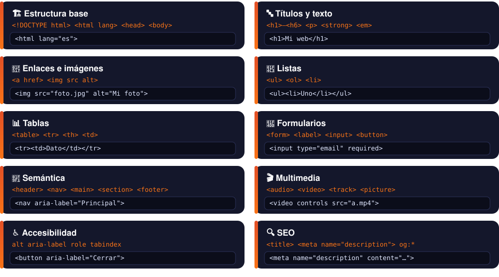

<details>
<summary>📎 Versión para copiar</summary>

| Para… | Usa | Ejemplo |
|---|---|---|
| 🏗️ Estructura base | `<!DOCTYPE html>` `<html lang>` `<head>` `<body>` | `<html lang="es">` |
| 🔤 Títulos y texto | `<h1>`–`<h6>` `<p>` `<strong>` `<em>` | `<h1>Mi web</h1>` |
| 🔗 Enlaces e imágenes | `<a href>` `` | `` |
| 📃 Listas | `<ul>` `<ol>` `<li>` | `<ul><li>Uno</li></ul>` |
| 📊 Tablas | `<table>` `<tr>` `<th>` `<td>` | `<tr><td>Dato</td></tr>` |
| 📝 Formularios | `<form>` `<label>` `<input>` `<button>` | `<input type="email" required>` |
| 🧱 Semántica | `<header>` `<nav>` `<main>` `<section>` `<footer>` | `<nav aria-label="Principal">` |
| 🎬 Multimedia | `<audio>` `<video>` `<track>` `<picture>` | `<video controls src="a.mp4">` |
| ♿ Accesibilidad | `alt` `aria-label` `role` `tabindex` | `<button aria-label="Cerrar">` |
| 🔍 SEO | `<title>` `<meta name="description">` `og:*` | `<meta name="description" content="…">` |

</details>


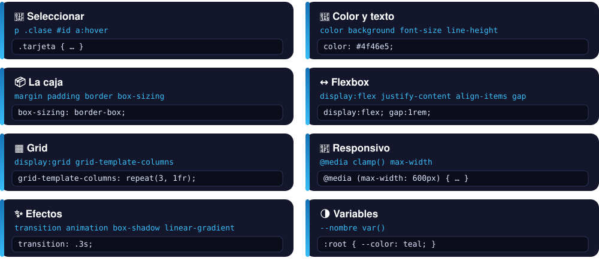

<details>
<summary>📎 Versión para copiar</summary>

| Para… | Usa | Ejemplo |
|---|---|---|
| 🎯 Seleccionar | `p` `.clase` `#id` `a:hover` | `.tarjeta { … }` |
| 🎨 Color y texto | `color` `background` `font-size` `line-height` | `color: #4f46e5;` |
| 📦 La caja | `margin` `padding` `border` `box-sizing` | `box-sizing: border-box;` |
| ↔️ Flexbox | `display:flex` `justify-content` `align-items` `gap` | `display:flex; gap:1rem;` |
| ▦ Grid | `display:grid` `grid-template-columns` | `grid-template-columns: repeat(3, 1fr);` |
| 📱 Responsivo | `@media` `clamp()` `max-width` | `@media (max-width: 600px) { … }` |
| ✨ Efectos | `transition` `animation` `box-shadow` `linear-gradient` | `transition: .3s;` |
| 🌗 Variables | `--nombre` `var()` | `:root { --color: teal; }` |

</details>


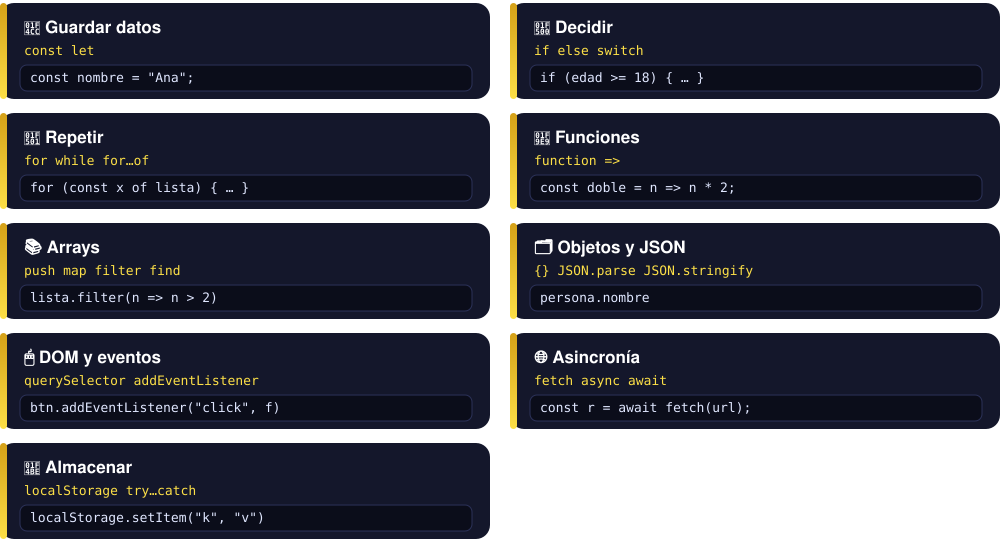

<details>
<summary>📎 Versión para copiar</summary>

| Para… | Usa | Ejemplo |
|---|---|---|
| 📌 Guardar datos | `const` `let` | `const nombre = "Ana";` |
| 🔀 Decidir | `if` `else` `switch` | `if (edad >= 18) { … }` |
| 🔁 Repetir | `for` `while` `for…of` | `for (const x of lista) { … }` |
| 🧩 Funciones | `function` `=>` | `const doble = n => n * 2;` |
| 📚 Arrays | `push` `map` `filter` `find` | `lista.filter(n => n > 2)` |
| 🗂️ Objetos y JSON | `{}` `JSON.parse` `JSON.stringify` | `persona.nombre` |
| 🖱️ DOM y eventos | `querySelector` `addEventListener` | `btn.addEventListener("click", f)` |
| 🌐 Asincronía | `fetch` `async` `await` | `const r = await fetch(url);` |
| 💾 Almacenar | `localStorage` `try…catch` | `localStorage.setItem("k", "v")` |

</details>


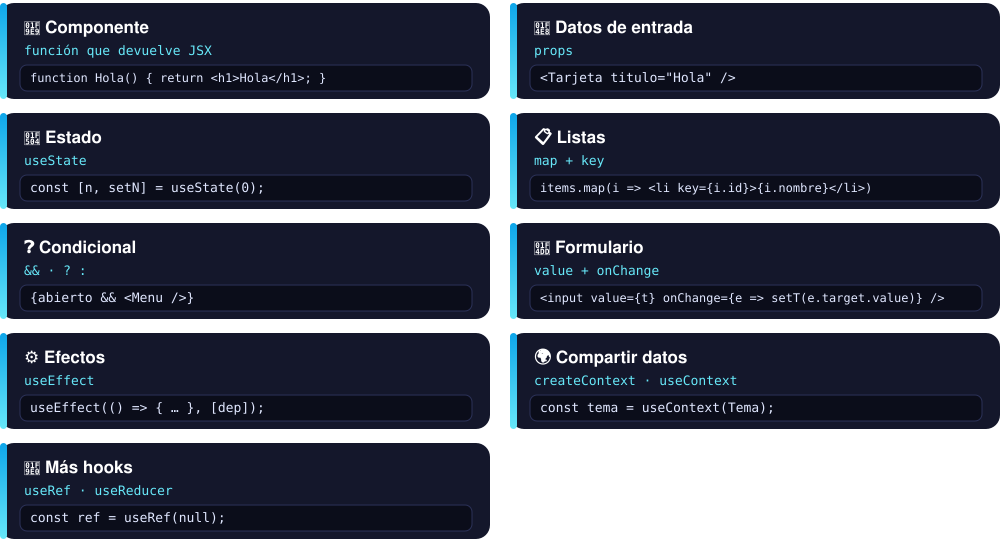

<details>
<summary>📎 Versión para copiar</summary>

| Para… | Usa | Ejemplo |
|---|---|---|
| 🧩 Componente | función que devuelve JSX | `function Hola() { return <h1>Hola</h1>; }` |
| 📨 Datos de entrada | `props` | `<Tarjeta titulo="Hola" />` |
| 🔄 Estado | `useState` | `const [n, setN] = useState(0);` |
| 📋 Listas | `map` + `key` | `items.map(i => <li key={i.id}>{i.nombre}</li>)` |
| ❓ Condicional | `&&` · `? :` | `{abierto && <Menu />}` |
| 📝 Formulario | `value` + `onChange` | `<input value={t} onChange={e => setT(e.target.value)} />` |
| ⚙️ Efectos | `useEffect` | `useEffect(() => { … }, [dep]);` |
| 🌍 Compartir datos | `createContext` · `useContext` | `const tema = useContext(Tema);` |
| 🧠 Más hooks | `useRef` · `useReducer` | `const ref = useRef(null);` |

</details>


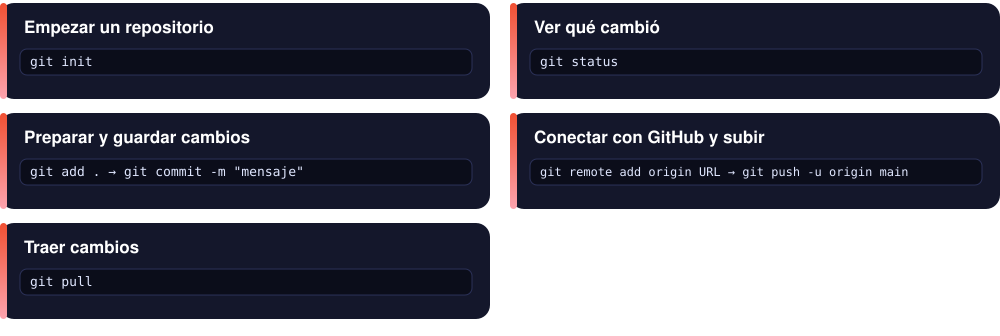

<details>
<summary>📎 Versión para copiar</summary>

| Para… | Comando |
|---|---|
| Empezar un repositorio | `git init` |
| Ver qué cambió | `git status` |
| Preparar y guardar cambios | `git add .` → `git commit -m "mensaje"` |
| Conectar con GitHub y subir | `git remote add origin URL` → `git push -u origin main` |
| Traer cambios | `git pull` |

</details>


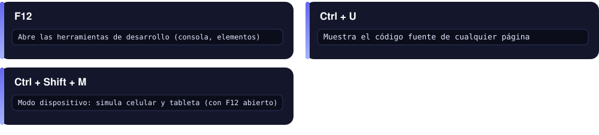

<details>
<summary>📎 Versión para copiar</summary>

| Atajo | Qué hace |
|---|---|
| `F12` | Abre las herramientas de desarrollo (consola, elementos) |
| `Ctrl` + `U` | Muestra el código fuente de cualquier página |
| `Ctrl` + `Shift` + `M` | Modo dispositivo: simula celular y tableta (con F12 abierto) |

</details>


</details>

## 💡 Consejos

✍️ **Escribe el código tú**, no lo copies · 💥 **Rompe cosas** en los editores para ver qué pasa · ⏱️ **Una lección al día** mejor que cinco de golpe · 🔁 **Repite el ejercicio** sin mirar la solución.

## ❓ FAQ

<details>
<summary><b>¿Necesito saber programar?</b></summary>

<br>No. El curso de HTML empieza desde cero y no asume nada. CSS pide haber hecho HTML, y JavaScript pide saber maquetar una página y React pide saber JavaScript (funciones, arrays y objetos); todos lo indican al inicio.
</details>

<details>
<summary><b>¿Qué necesito para empezar?</b></summary>

<br>Solo un navegador moderno (Chrome, Firefox, Edge o Safari). Los editores y la consola están dentro de cada lección. Cuando quieras trabajar en tus propios proyectos, instala un editor como [VS Code](https://code.visualstudio.com/).
</details>

<details>
<summary><b>¿Se guarda mi progreso? ¿Es fiable?</b></summary>

<br>Sí, pero **vive solo en tu navegador** (almacenamiento local del sitio), no en un servidor. Eso significa:

- ✅ Funciona sin cuentas y nadie más ve tu avance.
- ✅ Se conserva aunque cierres la pestaña o apagues la computadora.
- ⚠️ **No se sincroniza**: si cambias de navegador, dispositivo o perfil, empiezas de cero.
- ⚠️ **Se borra** si limpias los datos del sitio o las cookies, o si usas una ventana privada.
- ⚠️ Si abres el curso desde tu carpeta (`file://`) y desde la web, son dos progresos distintos.

Si el navegador bloquea el almacenamiento, el curso sigue funcionando; solo que no recordará tu avance.
</details>

<details>
<summary><b>¿Funciona sin internet?</b></summary>

<br>Sí. Clona el repositorio (o descárgalo en ZIP) y abre `index.html` con doble clic. Solo los ejemplos que consultan una API externa (lección de asincronía) necesitan conexión.
</details>

<details>
<summary><b>¿Cómo funciona el comprobador de ejercicios?</b></summary>

<br>Pegas tu código y el curso lo analiza **en tu navegador**: comprueba requisitos concretos (por ejemplo, «tiene un `<h1>`» o «la imagen tiene `alt`») y marca cuáles cumples y cuáles faltan, con una pista. No envía tu código a ningún sitio.
</details>

<details>
<summary><b>¿Cuánto tarda cada curso?</b></summary>

<br>HTML ≈ 10 h, CSS ≈ 12 h y JavaScript ≈ 14 h y React ≈ 14 h. Lo ideal es **una lección al día**: mejor constancia que maratones.
</details>

<details>
<summary><b>¿Cuánto cuesta y puedo usarlo en clase?</b></summary>

<br>Es gratis y de código abierto. El código va con licencia MIT y el contenido educativo va con [CC BY 4.0](LICENSE-CONTENIDO.md): puedes usarlo y compartirlo en clase citando la fuente.
</details>

<details>
<summary><b>Encontré un error o algo no se entiende</b></summary>

<br>Avísame con un [reporte de error](https://github.com/Cacg-code/PRACTICAS-HTML/issues/new?template=error.yml) o una [duda](https://github.com/Cacg-code/PRACTICAS-HTML/issues/new?template=duda.yml). Es la mejor forma de mejorar el curso.
</details>

## 💻 En tu computadora

```bash
git clone https://github.com/Cacg-code/PRACTICAS-HTML.git
cd PRACTICAS-HTML
# abre index.html en tu navegador
```

<details>
<summary><b>📁 Estructura</b></summary>

```text
index.html        Portada con los 4 cursos y la ruta
html/ css/ javascript/ react/   Una carpeta por curso (lecciones + proyecto)
NN-nombre/        Lecciones del curso de HTML
assets/           Estilos, script, GIFs, imágenes y multimedia
404.html · sitemap.xml
```
</details>

## 🤝 Contribuir

<div align="center">

[🐞 Reportar un error](https://github.com/Cacg-code/PRACTICAS-HTML/issues/new?template=error.yml) · [💡 Sugerir un tema](https://github.com/Cacg-code/PRACTICAS-HTML/issues/new?template=sugerencia.yml) · [❓ Preguntar una duda](https://github.com/Cacg-code/PRACTICAS-HTML/issues/new?template=duda.yml) · [⭐ Dar una estrella](https://github.com/Cacg-code/PRACTICAS-HTML)

</div>

---

<div align="center">

### ¿Listo para tu primera página web?

<a href="https://cacg-code.github.io/PRACTICAS-HTML/">
  
</a>

<sub>Código bajo licencia [MIT](LICENSE) · contenido en [LICENSE-CONTENIDO.md](LICENSE-CONTENIDO.md).<br>Material educativo elaborado con ayuda de inteligencia artificial. Contrástalo con [MDN](https://developer.mozilla.org/es/).</sub>

</div>
