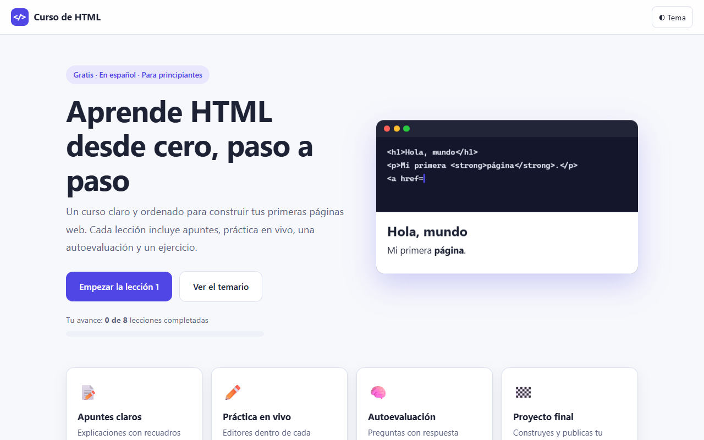
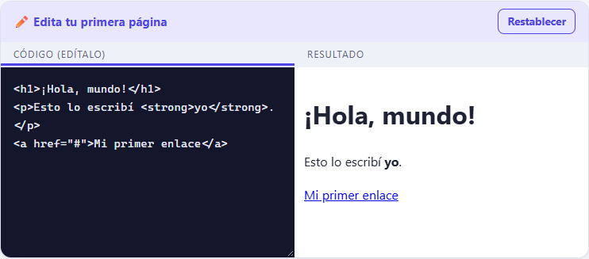
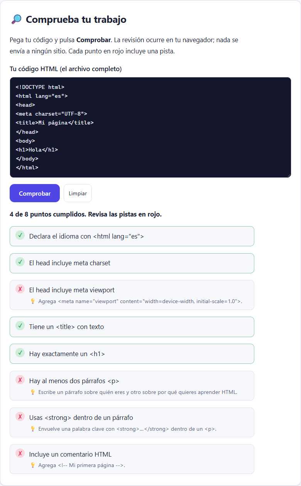

<div align="center">

<a href="https://cacg-code.github.io/PRACTICAS-HTML/">
  
</a>

<br>

<a href="https://cacg-code.github.io/PRACTICAS-HTML/">
  
</a>

<br>


[](https://github.com/Cacg-code/PRACTICAS-HTML)

**👉 [cacg-code.github.io/PRACTICAS-HTML](https://cacg-code.github.io/PRACTICAS-HTML/) 👈**

*Se abre en tu navegador. Sin cuentas, sin descargas, sin instalar nada.*

</div>

<p align="center">
  <a href="#-qué-es-esto"><b>Qué es</b></a> ·
  <a href="#-míralo-por-dentro"><b>Capturas</b></a> ·
  <a href="#️-ruta-de-aprendizaje"><b>Ruta</b></a> ·
  <a href="#-temario"><b>Temario</b></a> ·
  <a href="#-el-proyecto-final"><b>Proyecto</b></a> ·
  <a href="#-chuleta-de-etiquetas"><b>Chuleta</b></a> ·
  <a href="#-preguntas-frecuentes"><b>FAQ</b></a> ·
  <a href="#-después-del-curso"><b>Después</b></a>
</p>

---

## 🎯 ¿Qué es esto?

Un **curso gratuito de HTML en español**, hecho para quien nunca ha escrito una línea de código. No es solo texto para leer: en cada lección **escribes código y ves el resultado al instante**, te autoevalúas y practicas con ejercicios guiados.

Al terminar habrás construido **tu propia página personal** desde cero: con tablas, formularios, estilo, multimedia, accesibilidad, SEO y publicada en internet.

## ✨ Qué incluye cada lección

| | Componente | Para qué sirve |
|:-:|---|---|
| 📖 | **Apuntes claros** | Explicaciones cortas con recuadros de nota, advertencia, consejo y glosario |
| ⚡ | **Práctica en vivo** | Editores donde cambias el código y ves el resultado al instante |
| ✅ | **Autoevaluación** | Preguntas con respuesta inmediata y explicación de por qué |
| 🛠️ | **Ejercicio práctico** | Pasos, pistas y una solución de ejemplo para comparar |
| 🔍 | **Comprobador de ejercicios** | Pega tu código y te dice qué requisitos cumples y cuáles faltan |
| 📒 | **Apuntes y glosario** | Resumen al final de cada lección para repasar rápido |
| 💾 | **Borrador automático** | Tu código del ejercicio se guarda mientras escribes |
| 📈 | **Progreso guardado** | Tu avance queda marcado en tu navegador |
| 🌗 | **Modo claro y oscuro** | Se adapta a tu pantalla |

## 📸 Míralo por dentro

<div align="center">

**La portada, con tu avance**

<a href="https://cacg-code.github.io/PRACTICAS-HTML/"></a>

**Práctica en vivo: escribes a la izquierda, ves el resultado a la derecha**



**Comprobador: te dice qué cumples y qué te falta, con pistas**



</div>

## 🗺️ Ruta de aprendizaje

<div align="center">
  
</div>

## 📚 Temario

> Haz clic en cualquier lección para abrirla directamente en el navegador.

| # | Lección | Aprenderás a… | Entrar |
|:-:|---|---|:-:|
| 01 | **Primeros pasos** | Crear tu primer archivo HTML y entender su estructura | [▶ Abrir](https://cacg-code.github.io/PRACTICAS-HTML/01-primeros-pasos/) |
| 02 | **Texto, títulos y enlaces** | Dar formato al texto y conectar páginas | [▶ Abrir](https://cacg-code.github.io/PRACTICAS-HTML/02-texto-y-enlaces/) |
| 03 | **Imágenes y listas** | Insertar imágenes y organizar información en listas | [▶ Abrir](https://cacg-code.github.io/PRACTICAS-HTML/03-imagenes-y-listas/) |
| 04 | **Tablas** | Presentar datos en filas y columnas | [▶ Abrir](https://cacg-code.github.io/PRACTICAS-HTML/04-tablas/) |
| 05 | **Formularios** | Pedir datos al usuario con campos y botones | [▶ Abrir](https://cacg-code.github.io/PRACTICAS-HTML/05-formularios/) |
| 06 | **HTML semántico** | Estructurar la página con significado (header, main, footer…) | [▶ Abrir](https://cacg-code.github.io/PRACTICAS-HTML/06-html-semantico/) |
| 07 | **Introducción a CSS** | Darle color, tipografía y estilo a tu página | [▶ Abrir](https://cacg-code.github.io/PRACTICAS-HTML/07-introduccion-css/) |
| 08 | **Audio, video e imágenes adaptables** | Incrustar reproductores con subtítulos, contenido externo e imágenes que se ajustan a cada pantalla | [▶ Abrir](https://cacg-code.github.io/PRACTICAS-HTML/08-audio-y-video/) |
| 09 | **Accesibilidad** | Hacer tu página usable por todas las personas: contraste, teclado, ARIA y pruebas | [▶ Abrir](https://cacg-code.github.io/PRACTICAS-HTML/09-accesibilidad/) |
| 10 | **SEO y metadatos** | Mejorar título, descripción, vistas previas al compartir y datos para buscadores | [▶ Abrir](https://cacg-code.github.io/PRACTICAS-HTML/10-seo-y-metadatos/) |
| 11 | **Git y publicación** | Guardar el historial de tu proyecto, subirlo a GitHub y publicarlo en línea | [▶ Abrir](https://cacg-code.github.io/PRACTICAS-HTML/11-git-y-publicacion/) |
| 🏆 | **Proyecto final** | Construir tu página personal completa | [▶ Abrir](https://cacg-code.github.io/PRACTICAS-HTML/proyecto-pagina-personal/) |

## 🧪 Así se ve una lección

Cada tema sigue el mismo ciclo, para que aprendas haciendo:

```text
  1. LEE      →  apuntes cortos con ejemplos
  2. PRUEBA   →  edita el código en vivo y mira qué cambia
  3. COMPRUEBA →  responde la autoevaluación
  4. PRACTICA →  resuelve el ejercicio con pistas
  5. COMPARA  →  revisa la solución de ejemplo
```

Un adelanto de lo que escribirás en la primera lección:

```html
<!DOCTYPE html>
<html lang="es">
  <head>
    <meta charset="UTF-8">
    <title>Mi primera página</title>
  </head>
  <body>
    <h1>Hola, mundo</h1>
    <p>Mi primera <strong>página</strong> web.</p>
  </body>
</html>
```

## 🏆 El proyecto final

Al terminar las 11 lecciones construyes **tu página personal completa**, siguiendo estos pasos:

1. **Planifica** qué quieres mostrar
2. Prepara la **carpeta** del proyecto
3. Escribe el **HTML** y luego el **CSS**
4. **Revisa** tu trabajo con una lista de control
5. **Publícala** en internet

## 💡 Consejos para sacarle provecho

- ✍️ **Escribe el código tú mismo**, no lo copies: así se aprende.
- 💥 **Rompe cosas a propósito** en los editores en vivo para ver qué pasa.
- ⏱️ Mejor **una lección al día** que cinco de golpe.
- 🔁 **Repite el ejercicio** sin mirar la solución cuando termines.
- 🧪 Usa el **comprobador** antes de comparar con la solución de ejemplo.

## 🧾 Chuleta de etiquetas

Las que más usarás. Despliega para tenerlas a mano:

<details>
<summary><b>📋 Ver la chuleta</b></summary>

<br>

| Etiqueta | Para qué sirve | Ejemplo |
|---|---|---|
| `<h1>`–`<h6>` | Títulos (de más a menos importante) | `<h1>Mi web</h1>` |
| `<p>` | Párrafo | `<p>Hola</p>` |
| `<a href>` | Enlace | `<a href="https://mdn.dev">MDN</a>` |
| `` | Imagen | `` |
| `<ul>` `<ol>` `<li>` | Listas con viñetas / numeradas | `<ul><li>Uno</li></ul>` |
| `<table>` `<tr>` `<td>` | Tablas | `<tr><td>Dato</td></tr>` |
| `<form>` `<input>` `<button>` | Formularios | `<input type="email">` |
| `<header>` `<main>` `<footer>` | Estructura semántica | `<main>…</main>` |
| `<style>` | CSS dentro de la página | `p { color: teal; }` |
| `<audio>` `<video>` `<track>` | Reproductores y subtítulos | `<video controls src="demo.mp4"></video>` |
| `<picture>` `srcset` | Imágenes adaptables | `` |
| `aria-label` `role` | Accesibilidad | `<nav aria-label="Principal">` |
| `<meta>` `<link rel>` | SEO y vista previa al compartir | `<meta name="description" content="…">` |

</details>

## 🚀 Después del curso

Cuando termines el proyecto final, sigue por aquí:

- 🎨 **CSS a fondo:** [MDN – Aprende CSS](https://developer.mozilla.org/es/docs/Learn/CSS)
- ⚙️ **JavaScript:** [MDN – Aprende JavaScript](https://developer.mozilla.org/es/docs/Learn/JavaScript)
- 🌐 **Publica tu página gratis** con [GitHub Pages](https://pages.github.com/) (la lección 11 te guía paso a paso)
- 📱 **Hazla adaptable a celular** (diseño responsive)

## ❓ Preguntas frecuentes

<details>
<summary><b>¿Necesito saber programar?</b></summary>

<br>No. El curso empieza desde cero y no asume ningún conocimiento previo.
</details>

<details>
<summary><b>¿Qué necesito para empezar?</b></summary>

<br>Solo un navegador (Chrome, Firefox, Edge, Safari). Para los ejercicios fuera del curso te servirá un editor de texto como [VS Code](https://code.visualstudio.com/).
</details>

<details>
<summary><b>¿Se guarda mi progreso?</b></summary>

<br>Sí, en tu propio navegador. No hay cuentas ni se envía nada a ningún servidor. Si borras los datos del sitio, el progreso se reinicia.
</details>

<details>
<summary><b>¿Puedo usarlo sin internet?</b></summary>

<br>Sí. Clona el repositorio y abre `index.html` con doble clic.
</details>

<details>
<summary><b>¿Cuánto cuesta?</b></summary>

<br>Nada. Es gratuito y de código abierto.
</details>

## 💻 Úsalo en tu computadora

```bash
git clone https://github.com/Cacg-code/PRACTICAS-HTML.git
cd PRACTICAS-HTML
# abre index.html en tu navegador (doble clic)
```

<details>
<summary><b>📁 Estructura del repositorio</b></summary>

```text
index.html                  Portada con el temario y el avance
assets/                     Estilos (estilos.css), script (curso.js), imágenes y multimedia (audio, video, subtítulos)
NN-nombre-leccion/          Una carpeta por lección (index.html + ejercicio.html)
proyecto-pagina-personal/   Proyecto final
```
</details>

## 🤝 Contribuir

¿Encontraste un error o tienes una idea? Abre un [issue](https://github.com/Cacg-code/PRACTICAS-HTML/issues) o envía un pull request.

---

<div align="center">

### ¿Listo para tu primera página web?

<a href="https://cacg-code.github.io/PRACTICAS-HTML/">
  
</a>

<sub>Licencia [MIT](LICENSE): úsalo, compártelo y modifícalo libremente.<br>Material educativo elaborado con ayuda de inteligencia artificial. Contrástalo con la documentación oficial: [MDN](https://developer.mozilla.org/es/).</sub>

</div>
