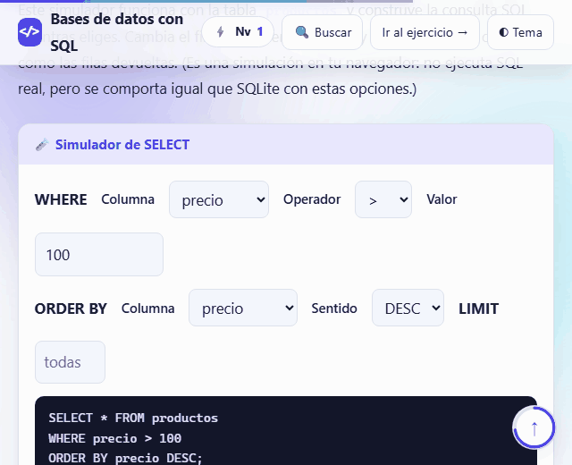
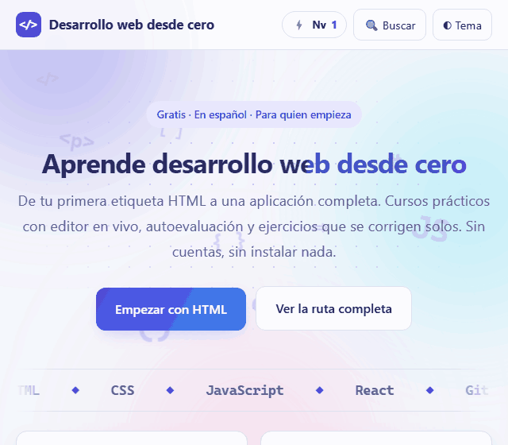
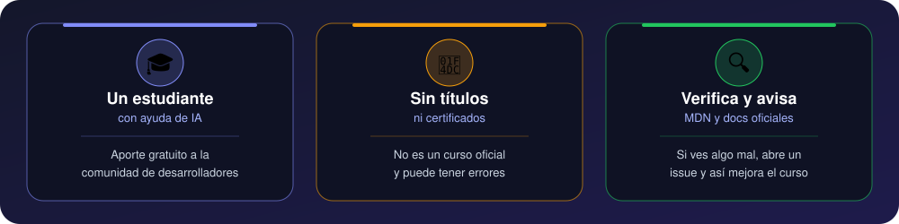
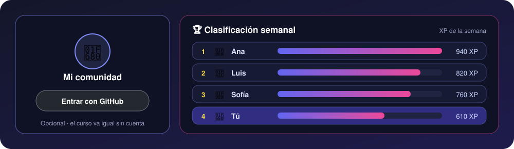
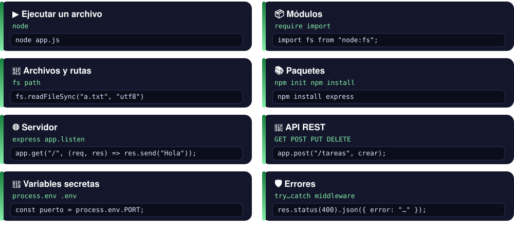
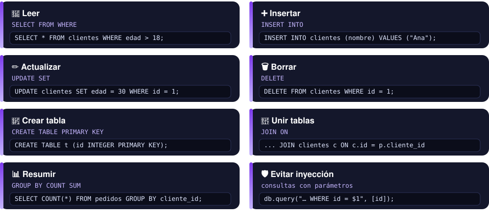
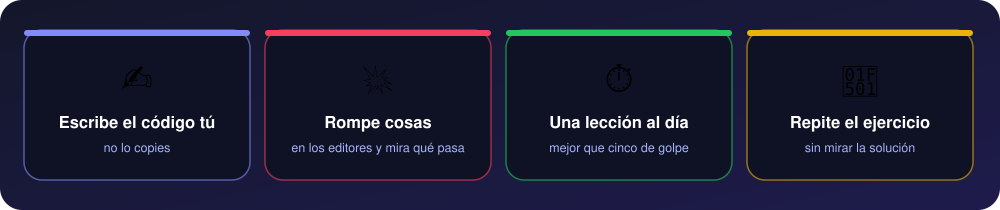
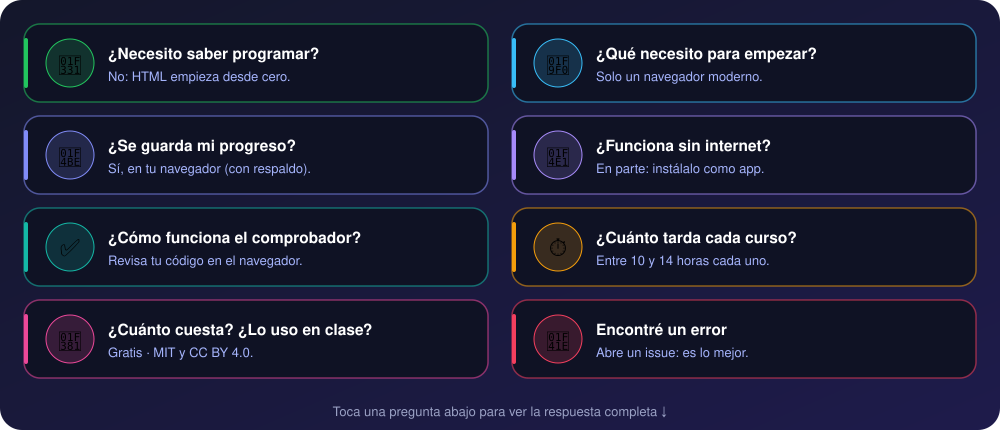

<div align="center">

<a href="https://cacg-code.github.io/web-desde-cero/">
  
</a>

<br>

<a href="https://cacg-code.github.io/web-desde-cero/">
  
</a>

<br>


*Se abre en tu navegador. Sin cuentas, sin descargas, sin instalar nada. Instalable como app y con progreso, niveles y rachas.*


</div>

<p align="center">
  <a href="#-los-cursos"><b>Cursos</b></a> ·
  <a href="#-míralo-en-acción"><b>En acción</b></a> ·
  <a href="#️-ruta"><b>Ruta</b></a> ·
  <a href="#-cada-lección"><b>Lección</b></a> ·
  <a href="#-progreso-y-recompensas"><b>Recompensas</b></a> ·
  <a href="#-chuleta"><b>Chuleta</b></a> ·
  <a href="#-faq"><b>FAQ</b></a> ·
  <a href="#-contribuir"><b>Contribuir</b></a>
</p>

---

## 🎓 Los cursos

Sigue el orden: cada curso se apoya en el anterior.

> **Siguiente paso:** cuando termines JavaScript y Node, aprende a crear un bot real en el curso gratis [Chatbots de WhatsApp desde cero](https://cacg-code.github.io/chatbots-whatsapp-desde-cero/).

<div align="center">


**[▶ Empezar HTML](https://cacg-code.github.io/web-desde-cero/html/)** &nbsp;·&nbsp; **[▶ Empezar CSS](https://cacg-code.github.io/web-desde-cero/css/)** &nbsp;·&nbsp; **[▶ Empezar JavaScript](https://cacg-code.github.io/web-desde-cero/javascript/)** &nbsp;·&nbsp; **[▶ Empezar React](https://cacg-code.github.io/web-desde-cero/react/)** &nbsp;·&nbsp; **[▶ Node.js](https://cacg-code.github.io/web-desde-cero/node/)** &nbsp;·&nbsp; **[▶ Bases de datos](https://cacg-code.github.io/web-desde-cero/bd/)**

</div>

## 🎬 Míralo en acción

<div align="center">


&nbsp;&nbsp;&nbsp;&nbsp;&nbsp;

<br><br><br>


&nbsp;&nbsp;&nbsp;&nbsp;&nbsp;

<br><br><br>


&nbsp;&nbsp;&nbsp;&nbsp;&nbsp;

<br><br><br>


&nbsp;&nbsp;&nbsp;&nbsp;&nbsp;

</div>

## 🗺️ Ruta

<div align="center">
  
</div>

## 🔁 Cada lección

<div align="center">


⚡ Editores en vivo y **consola** en JavaScript &nbsp;·&nbsp; 🔍 **Comprobador** de ejercicios<br>
💾 Borrador y progreso guardados &nbsp;·&nbsp; 🌗 Modo claro y oscuro<br>
♿ Accesible (teclado, contraste) &nbsp;·&nbsp; 📱 Celular, tableta y escritorio

</div>

### 📚 Temario completo · 60 lecciones y 6 proyectos

<div align="center">



**[▶ HTML](https://cacg-code.github.io/web-desde-cero/html/)** &nbsp;·&nbsp; **[▶ CSS](https://cacg-code.github.io/web-desde-cero/css/)** &nbsp;·&nbsp; **[▶ JavaScript](https://cacg-code.github.io/web-desde-cero/javascript/)** &nbsp;·&nbsp; **[▶ React](https://cacg-code.github.io/web-desde-cero/react/)** &nbsp;·&nbsp; **[▶ Node.js](https://cacg-code.github.io/web-desde-cero/node/)** &nbsp;·&nbsp; **[▶ Bases de datos](https://cacg-code.github.io/web-desde-cero/bd/)**

</div>

<details>
<summary>🔗 Ver con enlace a cada lección</summary>

<br>

| | 🟠 HTML | 🔵 CSS | 🟡 JavaScript | 🔷 React |
|:-:|---|---|---|---|
| 01 | [Primeros pasos](https://cacg-code.github.io/web-desde-cero/01-primeros-pasos/) | [Cómo funciona CSS](https://cacg-code.github.io/web-desde-cero/css/01-como-funciona/) | [Primeros pasos](https://cacg-code.github.io/web-desde-cero/javascript/01-primeros-pasos/) | [Qué es React](https://cacg-code.github.io/web-desde-cero/react/01-que-es-react/) |
| 02 | [Texto y enlaces](https://cacg-code.github.io/web-desde-cero/02-texto-y-enlaces/) | [Selectores y especificidad](https://cacg-code.github.io/web-desde-cero/css/02-selectores/) | [Variables y tipos](https://cacg-code.github.io/web-desde-cero/javascript/02-variables-y-tipos/) | [JSX a fondo](https://cacg-code.github.io/web-desde-cero/react/02-jsx/) |
| 03 | [Imágenes y listas](https://cacg-code.github.io/web-desde-cero/03-imagenes-y-listas/) | [Color y tipografía](https://cacg-code.github.io/web-desde-cero/css/03-color-y-texto/) | [Operadores y decisiones](https://cacg-code.github.io/web-desde-cero/javascript/03-operadores-y-decisiones/) | [Componentes y props](https://cacg-code.github.io/web-desde-cero/react/03-componentes-y-props/) |
| 04 | [Tablas](https://cacg-code.github.io/web-desde-cero/04-tablas/) | [La caja y el flujo](https://cacg-code.github.io/web-desde-cero/css/04-caja-y-flujo/) | [Bucles](https://cacg-code.github.io/web-desde-cero/javascript/04-bucles/) | [Estado con useState](https://cacg-code.github.io/web-desde-cero/react/04-estado/) |
| 05 | [Formularios](https://cacg-code.github.io/web-desde-cero/05-formularios/) | [Posicionamiento](https://cacg-code.github.io/web-desde-cero/css/05-posicionamiento/) | [Funciones](https://cacg-code.github.io/web-desde-cero/javascript/05-funciones/) | [Listas y condicionales](https://cacg-code.github.io/web-desde-cero/react/05-listas-y-condicionales/) |
| 06 | [HTML semántico](https://cacg-code.github.io/web-desde-cero/06-html-semantico/) | [Flexbox](https://cacg-code.github.io/web-desde-cero/css/06-flexbox/) | [Arrays](https://cacg-code.github.io/web-desde-cero/javascript/06-arrays/) | [Formularios controlados](https://cacg-code.github.io/web-desde-cero/react/06-formularios/) |
| 07 | [Introducción a CSS](https://cacg-code.github.io/web-desde-cero/07-introduccion-css/) | [CSS Grid](https://cacg-code.github.io/web-desde-cero/css/07-grid/) | [Objetos y JSON](https://cacg-code.github.io/web-desde-cero/javascript/07-objetos/) | [Efectos con useEffect](https://cacg-code.github.io/web-desde-cero/react/07-efectos/) |
| 08 | [Audio y video](https://cacg-code.github.io/web-desde-cero/08-audio-y-video/) | [Diseño responsivo](https://cacg-code.github.io/web-desde-cero/css/08-responsivo/) | [El DOM](https://cacg-code.github.io/web-desde-cero/javascript/08-dom/) | [Compartir estado y Context](https://cacg-code.github.io/web-desde-cero/react/08-compartir-estado/) |
| 09 | [Accesibilidad](https://cacg-code.github.io/web-desde-cero/09-accesibilidad/) | [Fondos y degradados](https://cacg-code.github.io/web-desde-cero/css/09-fondos-y-efectos/) | [Eventos y formularios](https://cacg-code.github.io/web-desde-cero/javascript/09-eventos/) | [useRef, useReducer y hooks propios](https://cacg-code.github.io/web-desde-cero/react/09-mas-hooks/) |
| 10 | [SEO y metadatos](https://cacg-code.github.io/web-desde-cero/10-seo-y-metadatos/) | [Animaciones](https://cacg-code.github.io/web-desde-cero/css/10-animaciones/) | [Asincronía y APIs](https://cacg-code.github.io/web-desde-cero/javascript/10-asincronia/) | [Datos de internet](https://cacg-code.github.io/web-desde-cero/react/10-datos-de-internet/) |
| 11 | [Git y publicación](https://cacg-code.github.io/web-desde-cero/11-git-y-publicacion/) | [Variables y temas](https://cacg-code.github.io/web-desde-cero/css/11-variables-y-temas/) | [Errores y almacenamiento](https://cacg-code.github.io/web-desde-cero/javascript/11-errores-y-almacenamiento/) | [Proyectos reales con Vite](https://cacg-code.github.io/web-desde-cero/react/11-proyectos-reales/) |
| 🏆 | [Tu página personal](https://cacg-code.github.io/web-desde-cero/proyecto-pagina-personal/) | [Landing responsiva](https://cacg-code.github.io/web-desde-cero/css/proyecto-landing/) | [Lista de tareas](https://cacg-code.github.io/web-desde-cero/javascript/proyecto-tareas/) | [Carrito de compras](https://cacg-code.github.io/web-desde-cero/react/proyecto-carrito/) |

| | 🟢 Node.js | 🟣 Bases de datos |
|:-:|---|---|
| 01 | [Qué es Node.js](https://cacg-code.github.io/web-desde-cero/node/01-que-es-node/) | [Qué es una base de datos](https://cacg-code.github.io/web-desde-cero/bd/01-que-es-una-base-de-datos/) |
| 02 | [Módulos y fs](https://cacg-code.github.io/web-desde-cero/node/02-modulos/) | [Consultar con SELECT](https://cacg-code.github.io/web-desde-cero/bd/02-consultar-con-select/) |
| 03 | [npm y package.json](https://cacg-code.github.io/web-desde-cero/node/03-npm-y-package-json/) | [Insertar, actualizar, borrar](https://cacg-code.github.io/web-desde-cero/bd/03-insertar-actualizar-borrar/) |
| 04 | [Servidor con Express](https://cacg-code.github.io/web-desde-cero/node/04-servidor-express/) | [Diseñar tablas](https://cacg-code.github.io/web-desde-cero/bd/04-disenar-tablas/) |
| 05 | [API REST](https://cacg-code.github.io/web-desde-cero/node/05-api-rest/) | [Relaciones y JOIN](https://cacg-code.github.io/web-desde-cero/bd/05-relaciones-y-join/) |
| 06 | [Consumir APIs y .env](https://cacg-code.github.io/web-desde-cero/node/06-consumir-apis/) | [Agrupar y resumir](https://cacg-code.github.io/web-desde-cero/bd/06-agrupar-y-resumir/) |
| 07 | [Errores y seguridad](https://cacg-code.github.io/web-desde-cero/node/07-errores-y-seguridad/) | [SQLite y PostgreSQL](https://cacg-code.github.io/web-desde-cero/bd/07-sqlite-y-postgresql/) |
| 08 | [Despliegue](https://cacg-code.github.io/web-desde-cero/node/08-despliegue/) | [Seguridad en SQL](https://cacg-code.github.io/web-desde-cero/bd/08-seguridad/) |
| 🏆 | [API de tareas](https://cacg-code.github.io/web-desde-cero/node/proyecto-api-tareas/) | [Base de datos de una tienda](https://cacg-code.github.io/web-desde-cero/bd/proyecto-tienda/) |

</details>

## 🎮 Progreso y recompensas

<div align="center">



</div>

<div align="center">

🏅 **XP y niveles** (8 títulos) &nbsp;·&nbsp; 🔥 **Rachas** con 🛡️ escudos &nbsp;·&nbsp; 🎯 **Meta semanal**<br>
🧠 **Reto del día** (+25 XP) &nbsp;·&nbsp; 🎨 **Temas y avatares** que se desbloquean al subir de nivel<br>
📄 **Chuletas imprimibles** al terminar un curso &nbsp;·&nbsp; 📤 **Insignia para compartir** &nbsp;·&nbsp; 💾 **Código de respaldo**

</div>

Pulsa el chip de XP de la barra superior para abrir **Mi progreso**. Todo se guarda en tu navegador: es solo motivación personal, no da ningún título.

## 🙋 Acerca de este material

<div align="center">



</div>

Lo hace **un estudiante** con ayuda de inteligencia artificial, como aporte gratuito a la comunidad de desarrolladores: no es un curso oficial, no da títulos ni certificados y puede tener errores. Contrástalo con [MDN](https://developer.mozilla.org/es/) y la documentación oficial, y si ves algo mal, [avísame](https://github.com/Cacg-code/web-desde-cero/issues/new/choose).

## 🌐 Comunidad

<div align="center">



</div>

Entra con tu cuenta de GitHub desde el panel **Mi comunidad** y tu progreso se guarda en la nube: apodo, avatar, reto diario y clasificación semanal. Es opcional: el curso funciona igual sin cuenta. El esquema de la base de datos está en [`backend/supabase.sql`](backend/supabase.sql).

## 🧾 Chuleta

<details>
<summary><b>📋 Abrir la chuleta (HTML · CSS · JavaScript · React · Node.js · SQL · Git)</b></summary>

<br>


<details>
<summary>📎 Versión para copiar</summary>

| Para… | Usa | Ejemplo |
|---|---|---|
| 🏗️ Estructura base | `<!DOCTYPE html>` `<html lang>` `<head>` `<body>` | `<html lang="es">` |
| 🔤 Títulos y texto | `<h1>`–`<h6>` `<p>` `<strong>` `<em>` | `<h1>Mi web</h1>` |
| 🔗 Enlaces e imágenes | `<a href>` `` | `` |
| 📃 Listas | `<ul>` `<ol>` `<li>` | `<ul><li>Uno</li></ul>` |
| 📊 Tablas | `<table>` `<tr>` `<th>` `<td>` | `<tr><td>Dato</td></tr>` |
| 📝 Formularios | `<form>` `<label>` `<input>` `<button>` | `<input type="email" required>` |
| 🧱 Semántica | `<header>` `<nav>` `<main>` `<section>` `<footer>` | `<nav aria-label="Principal">` |
| 🎬 Multimedia | `<audio>` `<video>` `<track>` `<picture>` | `<video controls src="a.mp4">` |
| ♿ Accesibilidad | `alt` `aria-label` `role` `tabindex` | `<button aria-label="Cerrar">` |
| 🔍 SEO | `<title>` `<meta name="description">` `og:*` | `<meta name="description" content="…">` |

</details>


<details>
<summary>📎 Versión para copiar</summary>

| Para… | Usa | Ejemplo |
|---|---|---|
| 🎯 Seleccionar | `p` `.clase` `#id` `a:hover` | `.tarjeta { … }` |
| 🎨 Color y texto | `color` `background` `font-size` `line-height` | `color: #4f46e5;` |
| 📦 La caja | `margin` `padding` `border` `box-sizing` | `box-sizing: border-box;` |
| ↔️ Flexbox | `display:flex` `justify-content` `align-items` `gap` | `display:flex; gap:1rem;` |
| ▦ Grid | `display:grid` `grid-template-columns` | `grid-template-columns: repeat(3, 1fr);` |
| 📱 Responsivo | `@media` `clamp()` `max-width` | `@media (max-width: 600px) { … }` |
| ✨ Efectos | `transition` `animation` `box-shadow` `linear-gradient` | `transition: .3s;` |
| 🌗 Variables | `--nombre` `var()` | `:root { --color: teal; }` |

</details>


<details>
<summary>📎 Versión para copiar</summary>

| Para… | Usa | Ejemplo |
|---|---|---|
| 📌 Guardar datos | `const` `let` | `const nombre = "Ana";` |
| 🔀 Decidir | `if` `else` `switch` | `if (edad >= 18) { … }` |
| 🔁 Repetir | `for` `while` `for…of` | `for (const x of lista) { … }` |
| 🧩 Funciones | `function` `=>` | `const doble = n => n * 2;` |
| 📚 Arrays | `push` `map` `filter` `find` | `lista.filter(n => n > 2)` |
| 🗂️ Objetos y JSON | `{}` `JSON.parse` `JSON.stringify` | `persona.nombre` |
| 🖱️ DOM y eventos | `querySelector` `addEventListener` | `btn.addEventListener("click", f)` |
| 🌐 Asincronía | `fetch` `async` `await` | `const r = await fetch(url);` |
| 💾 Almacenar | `localStorage` `try…catch` | `localStorage.setItem("k", "v")` |

</details>


<details>
<summary>📎 Versión para copiar</summary>

| Para… | Usa | Ejemplo |
|---|---|---|
| 🧩 Componente | función que devuelve JSX | `function Hola() { return <h1>Hola</h1>; }` |
| 📨 Datos de entrada | `props` | `<Tarjeta titulo="Hola" />` |
| 🔄 Estado | `useState` | `const [n, setN] = useState(0);` |
| 📋 Listas | `map` + `key` | `items.map(i => <li key={i.id}>{i.nombre}</li>)` |
| ❓ Condicional | `&&` · `? :` | `{abierto && <Menu />}` |
| 📝 Formulario | `value` + `onChange` | `<input value={t} onChange={e => setT(e.target.value)} />` |
| ⚙️ Efectos | `useEffect` | `useEffect(() => { … }, [dep]);` |
| 🌍 Compartir datos | `createContext` · `useContext` | `const tema = useContext(Tema);` |
| 🧠 Más hooks | `useRef` · `useReducer` | `const ref = useRef(null);` |

</details>




<details>
<summary>📎 Versión para copiar</summary>

| Para… | Usa | Ejemplo |
|---|---|---|
| ▶️ Ejecutar un archivo | `node` | `node app.js` |
| 📦 Módulos | `require` · `import` | `import fs from "node:fs";` |
| 📁 Archivos y rutas | `fs` · `path` | `fs.readFileSync("a.txt", "utf8")` |
| 📚 Paquetes | `npm init` · `npm install` | `npm install express` |
| 🌐 Servidor | `express()` · `app.listen` | `app.get("/", (req, res) => res.send("Hola"));` |
| 🔌 API REST | `GET` `POST` `PUT` `DELETE` | `app.post("/tareas", crear);` |
| 🔐 Variables secretas | `process.env` | `process.env.PORT` |
| 🛡️ Errores | `try…catch` · middleware | `res.status(400).json({ error: "…" })` |

</details>




<details>
<summary>📎 Versión para copiar</summary>

| Para… | Usa | Ejemplo |
|---|---|---|
| 🔎 Leer | `SELECT` `FROM` `WHERE` | `SELECT * FROM clientes WHERE edad > 18;` |
| ➕ Insertar | `INSERT INTO` | `INSERT INTO clientes (nombre) VALUES ('Ana');` |
| ✏️ Actualizar | `UPDATE` `SET` | `UPDATE clientes SET edad = 30 WHERE id = 1;` |
| 🗑️ Borrar | `DELETE` | `DELETE FROM clientes WHERE id = 1;` |
| 🧱 Crear tabla | `CREATE TABLE` `PRIMARY KEY` | `CREATE TABLE t (id INTEGER PRIMARY KEY);` |
| 🔗 Unir tablas | `JOIN` `ON` | `SELECT * FROM pedidos p JOIN clientes c ON c.id = p.cliente_id;` |
| 📊 Resumir | `GROUP BY` `COUNT` `SUM` | `SELECT cliente_id, COUNT(*) FROM pedidos GROUP BY cliente_id;` |
| 🛡️ Evitar inyección | consultas con parámetros | `db.query("… WHERE id = $1", [id])` |

</details>


<details>
<summary>📎 Versión para copiar</summary>

| Para… | Comando |
|---|---|
| Empezar un repositorio | `git init` |
| Ver qué cambió | `git status` |
| Preparar y guardar cambios | `git add .` → `git commit -m "mensaje"` |
| Conectar con GitHub y subir | `git remote add origin URL` → `git push -u origin main` |
| Traer cambios | `git pull` |

</details>


<details>
<summary>📎 Versión para copiar</summary>

| Atajo | Qué hace |
|---|---|
| `F12` | Abre las herramientas de desarrollo (consola, elementos) |
| `Ctrl` + `U` | Muestra el código fuente de cualquier página |
| `Ctrl` + `Shift` + `M` | Modo dispositivo: simula celular y tableta (con F12 abierto) |

</details>


</details>

## 💡 Consejos

<div align="center">



</div>

✍️ **Escribe el código tú**, no lo copies · 💥 **Rompe cosas** en los editores para ver qué pasa · ⏱️ **Una lección al día** mejor que cinco de golpe · 🔁 **Repite el ejercicio** sin mirar la solución.

## ❓ FAQ

<div align="center">



</div>

<details>
<summary><b>¿Necesito saber programar?</b></summary>

<br>No. El curso de HTML empieza desde cero y no asume nada. CSS pide haber hecho HTML, JavaScript pide saber maquetar una página, React pide saber JavaScript (funciones, arrays y objetos), Node.js pide JavaScript y Bases de datos no exige nada previo (en la lección de SQLite se instala una herramienta); todos lo indican al inicio.
</details>

<details>
<summary><b>¿Qué necesito para empezar?</b></summary>

<br>Solo un navegador moderno (Chrome, Firefox, Edge o Safari). Los editores y la consola están dentro de cada lección. Cuando quieras trabajar en tus propios proyectos, instala un editor como [Cursor](https://cursor.com/) (con [guía oficial](https://docs.cursor.com/)) o [VS Code](https://code.visualstudio.com/).
</details>

<details>
<summary><b>¿Se guarda mi progreso? ¿Es fiable?</b></summary>

<br>Sí, pero **vive solo en tu navegador** (almacenamiento local del sitio), no en un servidor. Eso significa:

- ✅ Funciona sin cuentas y nadie más ve tu avance.
- ✅ Se conserva aunque cierres la pestaña o apagues la computadora.
- ⚠️ **No se sincroniza**: puedes pasarlo con el código de respaldo del panel «Mi progreso». Si cambias de navegador, dispositivo o perfil, empiezas de cero.
- ⚠️ **Se borra** si limpias los datos del sitio o las cookies, o si usas una ventana privada.
- ⚠️ Si abres el curso desde tu carpeta (`file://`) y desde la web, son dos progresos distintos.

Si el navegador bloquea el almacenamiento, el curso sigue funcionando; solo que no recordará tu avance.
</details>

<details>
<summary><b>¿Funciona sin internet?</b></summary>

<br>En parte. El sitio se puede **instalar como app** (menú del navegador → «Instalar») y las páginas que ya visitaste se abren sin conexión. También puedes clonar el repositorio (o descargarlo en ZIP) y abrir `index.html` con doble clic. Los ejemplos que consultan una API externa y los ejercicios de Node.js y SQL en tu computadora necesitan conexión o instalar Node.js.
</details>

<details>
<summary><b>¿Cómo funciona el comprobador de ejercicios?</b></summary>

<br>Pegas tu código y el curso lo analiza **en tu navegador**: comprueba requisitos concretos (por ejemplo, «tiene un `<h1>`» o «la imagen tiene `alt`») y marca cuáles cumples y cuáles faltan, con una pista. No envía tu código a ningún sitio.
</details>

<details>
<summary><b>¿Cuánto tarda cada curso?</b></summary>

<br>HTML ≈ 10 h, CSS ≈ 12 h, JavaScript ≈ 14 h, React ≈ 14 h, Node.js ≈ 14 h y Bases de datos ≈ 12 h. Lo ideal es **una lección al día**: mejor constancia que maratones.
</details>

<details>
<summary><b>¿Cuánto cuesta y puedo usarlo en clase?</b></summary>

<br>Es gratis y de código abierto. El código va con licencia MIT y el contenido educativo va con [CC BY 4.0](LICENSE-CONTENIDO.md): puedes usarlo y compartirlo en clase citando la fuente.
</details>

<details>
<summary><b>Encontré un error o algo no se entiende</b></summary>

<br>Avísame con un [reporte de error](https://github.com/Cacg-code/web-desde-cero/issues/new?template=error.yml) o una [duda](https://github.com/Cacg-code/web-desde-cero/issues/new?template=duda.yml). Es la mejor forma de mejorar el curso.
</details>

## 💻 En tu computadora

```bash
git clone https://github.com/Cacg-code/web-desde-cero.git
cd web-desde-cero
# abre index.html en tu navegador
```

<details>
<summary><b>📁 Estructura</b></summary>

```text
index.html        Portada con los 6 cursos, la ruta y el panel de progreso
html/ css/ javascript/ react/ node/ bd/   Una carpeta por curso (lecciones + proyecto)
chuletas/         Chuletas imprimibles que se desbloquean al completar un curso
NN-nombre/        Lecciones del curso de HTML
assets/           Estilos, script, GIFs, imágenes y multimedia
assets/curso.js   Editor, comprobador, progreso, niveles y rachas
manifest.webmanifest · sw.js   App instalable y modo sin conexión
scripts/revisar.py   Revisión automática (enlaces, títulos, mapa del sitio)
404.html · sitemap.xml
```
</details>

## 🤝 Contribuir

<div align="center">

[🐞 Reportar un error](https://github.com/Cacg-code/web-desde-cero/issues/new?template=error.yml) · [💡 Sugerir un tema](https://github.com/Cacg-code/web-desde-cero/issues/new?template=sugerencia.yml) · [❓ Preguntar una duda](https://github.com/Cacg-code/web-desde-cero/issues/new?template=duda.yml) · [⭐ Dar una estrella](https://github.com/Cacg-code/web-desde-cero)

</div>

---

<div align="center">

### ¿Listo para tu primera página web?

<a href="https://cacg-code.github.io/web-desde-cero/">
  
</a>

<sub>Código bajo licencia [MIT](LICENSE) · contenido en [LICENSE-CONTENIDO.md](LICENSE-CONTENIDO.md).<br>Material educativo elaborado con ayuda de inteligencia artificial. Contrástalo con [MDN](https://developer.mozilla.org/es/).</sub>

</div>
